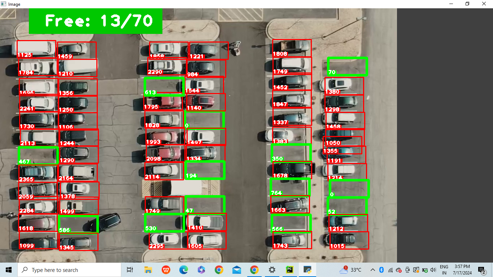
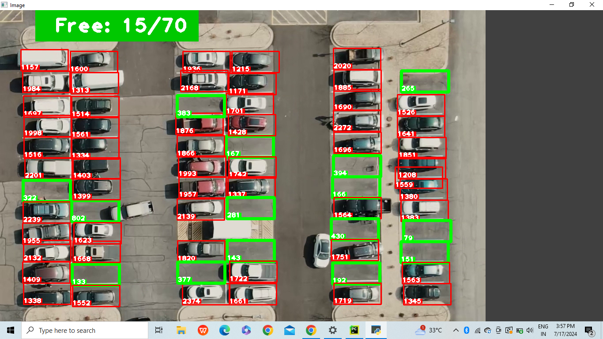

# Car Parking Space Counter

The Car Parking Space Counter is a sophisticated system designed to streamline parking management using computer vision technology. Developed with OpenCV, this project offers real-time detection and counting of available parking spaces in parking lots. By leveraging image processing techniques, it aims to enhance urban parking efficiency, reduce congestion, and improve the overall parking experience for drivers.

## Features
* Real-time Detection: Continuously monitors and updates the count of available parking spaces.
* High Accuracy: Utilizes advanced image processing techniques for precise detection.
* Customizable: Easily adjustable to different parking lot layouts and camera positions. 
* User-Friendly Interface:Displays the count of available spaces in an easy-to-understand format.

## Installation
### Prerequisites
* Python 3.x 
* OpenCV
* NumPy
* cvzone

## Usage
1. Initialize Parking Positions: Set up the parking space positions using a provided script.
2. Run the Main Detection Script: Start the main script to begin real-time detection using a video feed or camera input.

## Configuration
* Adjust parking space coordinates and detection parameters for optimal performance.

## Screenshots

* when some cars has left the parking slot

